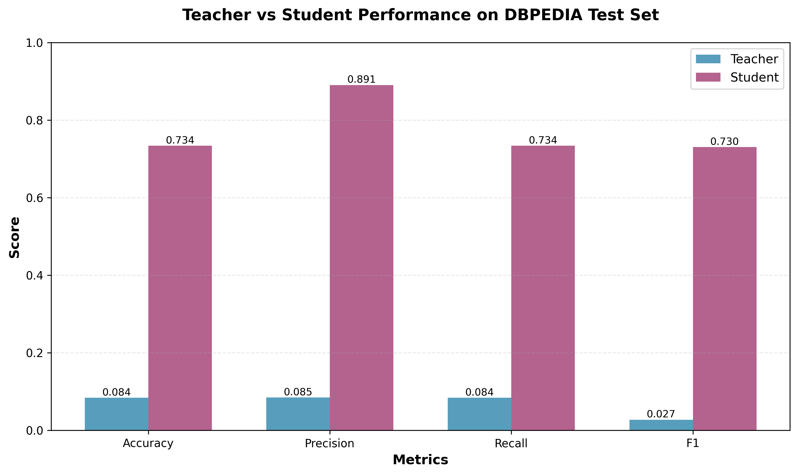

# LLM Distillation Project

Knowledge distillation framework for training smaller student models from larger teacher models using soft targets (KL divergence).



## Quick Start

### 1. Download Teacher Model
```bash
python scripts/download_deepseek_model.py
```

### 2. Explore and Download Dataset
```bash
python scripts/explore_datasets.py --dataset dbpedia --validation-split 0.2
```

### 3. Train Student Model with Knowledge Distillation

```bash
python scripts/train_soft_distillation.py \
  --dataset dbpedia \
  --teacher-model models/DeepSeek-R1-Distill-Qwen-1.5B \
  --student-model Qwen/Qwen2.5-0.5B \
  --epochs 3 \
  --batch-size 4 \
  --max-length 128 \
  --temperature 3.0 \
  --alpha 0.7
```

**What this does:**
- Loads both teacher and student models
- Teacher runs in eval mode (frozen, no gradients)
- Each training step:
  1. Teacher generates soft targets for batch
  2. Student learns from teacher's distribution (KL divergence)
  3. Student also learns from true labels (cross-entropy)
- Combined loss: `0.7 × KL_loss + 0.3 × CE_loss`

### 4. Evaluate and Compare

```bash
python scripts/compare_models.py \
  --teacher-model models/DeepSeek-R1-Distill-Qwen-1.5B \
  --student-model outputs/student_soft_distill/.../best_model \
  --dataset dbpedia
```

## Quick Testing

Test with a small subset before full training:

```bash
python scripts/train_soft_distillation.py \
  --dataset dbpedia \
  --teacher-model models/DeepSeek-R1-Distill-Qwen-1.5B \
  --student-model Qwen/Qwen2.5-0.5B \
  --max-train-samples 100 \
  --max-val-samples 100 \
  --batch-size 2 \
  --max-length 128 \
  --epochs 2
```

**Memory Tips for Apple MPS:**
- Start with small `--max-train-samples` (50-100)
- Use `--batch-size 2` or even `1`
- Keep `--max-length 128` or lower
- Consider smaller student models: `prajjwal1/bert-tiny`, `distilbert-base-uncased`

## Architecture

- **Teacher**: DeepSeek-R1-Distill-Qwen-1.5B (~1.5B params, frozen)
- **Student**: Qwen/Qwen2.5-0.5B (~0.5B params, 3x compression)
- **Dataset**: DBpedia 14-class classification (448k train, 112k val, 70k test)
- **Method**: Knowledge Distillation with soft targets
- **Loss**: `α × KL(teacher||student) + (1-α) × CE(truth, student)`
  - Temperature: 3.0 (softer distributions for better knowledge transfer)
  - Alpha: 0.7 (70% distillation, 30% supervised learning)

## Project Structure

```
llm-distill/
├── scripts/
│   ├── download_deepseek_model.py     # Download teacher model
│   ├── explore_datasets.py            # Dataset discovery & download
│   ├── train_soft_distillation.py     # Knowledge distillation training
│   └── compare_models.py              # Evaluate & compare models
├── data/
│   └── dbpedia/                       # Downloaded datasets
│       ├── train/
│       ├── validation/
│       └── test/
├── models/
│   └── DeepSeek-R1-Distill-Qwen-1.5B/ # Teacher model
└── outputs/
    └── student_soft_distill/          # Trained student checkpoints
        └── dbpedia_T3.0_A0.7_*/
            ├── best_model/
            ├── final_model/
            └── history.json
```

6. **Run Experiments**:
   - Execute your distillation process and evaluate the results.

7. **Analyze Results**:
   - Review the performance of the distilled model and make adjustments as necessary.

---

## Recommended packages ✅
Install the packages below for downloading, loading, and distilling models (GPU recommended):

```bash
pip install -r requirements.txt
```

Key packages included in `requirements.txt`:
- `huggingface-hub` (download, auth)
- `transformers` (model loading)
- `torch` (training/inference)
- `accelerate` (multi-GPU / mixed precision)
- `safetensors`, `sentencepiece`, `tokenizers` (fast and safe tokenizers/weights)
- `bitsandbytes`, `peft` (8-bit training / LoRA) — optional but useful for efficient experiments

## Which files to download from the Hugging Face model page ⚖️
When you're on the model page (`deepseek-ai/DeepSeek-R1-Distill-Qwen-1.5B`), prefer these files for use as the *teacher* model:
- `pytorch_model.bin` or `model.safetensors` (full or fp16 weights) — choose **safetensors** if offered.
- `config.json` and any `tokenizer` files (`tokenizer.json`, `tokenizer_config.json`, vocab files).

Avoid using quantized/ggml files as the teacher for distillation — those are intended for CPU inference and may degrade the teacher signal.

## How to download the model ✅
1. Authenticate to HF (recommended):
```bash
huggingface-cli login  # or set HUGGINGFACE_HUB_TOKEN env var
```

2. Use the provided helper script to snapshot the repo into `llm-distillation/models/`:
```bash
python scripts/download_model.py
```

Alternatively, download manually with Python:
```python
from huggingface_hub import snapshot_download
snapshot_download(repo_id='deepseek-ai/DeepSeek-R1-Distill-Qwen-1.5B', cache_dir='llm-distillation/models/DeepSeek-R1-Distill-Qwen-1.5B')
```

---

## Distillation script (quick start) 🔧
I added a lightweight distillation script at `scripts/distill.py`. It implements a simple training loop combining cross-entropy and KL-based logits distillation. The script is MPS-aware (uses Apple M1/M2/M3/M4 `mps` backend when available) and avoids fp16 on MPS by default.

Quick examples (run inside your `llm-distill` conda env):

- Minimal quick test using a tiny dataset (local text file or HF dataset):
```bash
conda activate llm-distill
python scripts/distill.py \
  --teacher-path llm-distillation/models/deepseek-ai_DeepSeek-R1-Distill-Qwen-1.5B/models--deepseek-ai--DeepSeek-R1-Distill-Qwen-1.5B/snapshots/ad9f0ae0864d7fbcd1cd905e3c6c5b069cc8b562 \
  --student-model gpt2 \
  --text-file /path/to/small_text_corpus.txt \
  --max-samples 500 \
  --batch-size 2 \
  --epochs 1 \
  --output-dir llm-distillation/out_student_test
```

- Use a HF dataset for quick runs (wikitext small):
```bash
python scripts/distill.py --teacher-path <teacher_path> --student-model gpt2 --dataset "wikitext/wikitext-2-raw-v1" --max-samples 1000 --batch-size 2
```

Notes:
- On Apple Silicon (M1/M2/M3/M4), the script will pick `mps` if available. MPS float16 support is limited — the script uses fp32 for MPS to be safe. ✅
- If you have CUDA GPUs and want FP16 training, add `--force-fp32` to override FP16 and force FP32; remove it to allow fp16 on CUDA.

---

(Existing instructions remain below.)
## Notes / tips 💡
- For distillation, using the teacher in full precision (fp32) or fp16 is best. If you must save memory, fp16 is acceptable. Do not use quantized weights as the teacher.
- If you plan to do memory-efficient fine-tuning or distillation on limited hardware, consider `bitsandbytes` + `accelerate` and training recipes like LoRA or progressive distillation.

---

## Additional Resources:
- Model page: https://huggingface.co/deepseek-ai/DeepSeek-R1-Distill-Qwen-1.5B
- Hugging Face docs: https://huggingface.co/docs
- Distillation overview: https://www.semanticscholar.org/topic/Knowledge-Distillation